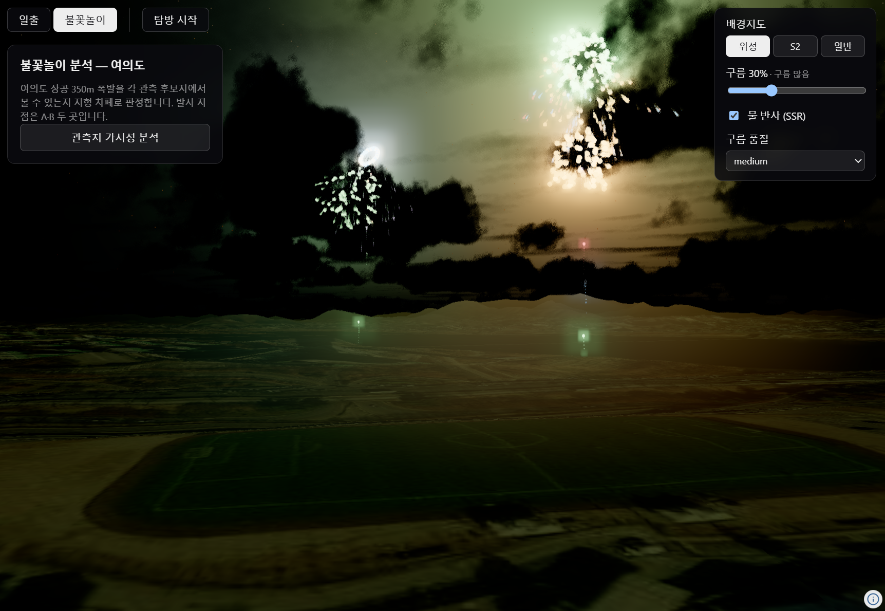
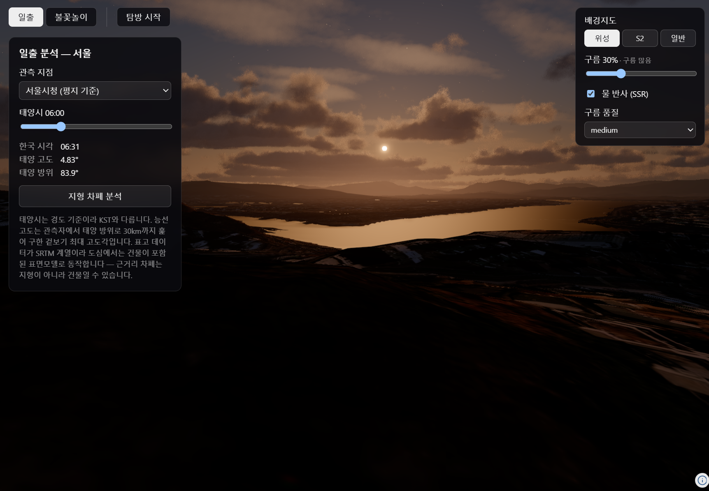

# navara-template

[Navara](https://github.com/reearth/navara) 3D GIS 엔진으로 서울의 **빛과 하늘**을 다뤄 보는 데모입니다.
일출이 언제 어디서 보이는지, 불꽃놀이가 어느 관측지에서 보이는지를 실제 지형으로 계산하고,
그 자리에 캐릭터를 세워 걸어다닐 수 있습니다.

| 불꽃놀이 분석 | 일출 분석 |
|---|---|
|  |  |

## Quick start

```bash
pnpm install
pnpm dev
```

브라우저에서 http://localhost:5173 을 엽니다.

> **첫 화면이 15~20초간 비어 보이는 것은 정상입니다.** WASM(약 4.6MB)과 대기 산란 텍스처,
> 지형·영상 타일을 받는 시간입니다. API 키는 필요 없습니다.

필요 환경: Node.js LTS, [pnpm](https://pnpm.io/)

```bash
pnpm build       # 타입체크 후 프로덕션 빌드
pnpm preview     # 빌드 결과 미리보기
pnpm typecheck   # 타입체크만
```

## 무엇을 하는 프로젝트인가

Navara는 GIS 로직을 Rust/WebAssembly에, 렌더링을 Three.js에 맡긴 3D 지도 엔진입니다.
이 저장소는 그 엔진의 **빛 관련 기능**(태양 위치, 대기 산란, 볼류메트릭 구름, 발광·블룸,
별과 달)과 **지형 샘플링**을 실제 문제에 적용해 본 것입니다.

화면은 두 축으로 나뉩니다. **분석**(일출 / 불꽃놀이)은 서로 배타적인 탭이고,
**탐방**은 그와 무관하게 켜고 끄는 토글이라 분석 결과를 띄워둔 채 현장을 걸어다닐 수 있습니다.

### 일출 분석

서울의 해맞이 명소 8곳 중 관측 지점을 고르면, 그 지점에서 해가 실제로 보이기 시작하는
시각을 계산합니다. 수평선 기준 일출은 산이나 건물에 가리는 경우를 반영하지 못하므로,
관측자에서 태양 방위로 30km까지 지형을 훑어 **능선의 겉보기 고도각**을 구하고
태양이 그 능선을 넘는 순간을 찾습니다.

수평선 기준 일출이 05:33인 날의 계산 결과입니다.

| 관측지 | 표고 | 지형 반영 일출 |
|---|---|---|
| 안산 봉수대 | 297m | 05:33 (0분) |
| 용마산 정상 | 351m | 05:35 (+2분) |
| 서울시청 (평지) | 56m | 05:39 (+6분) |
| 아차산 해맞이광장 | 138m | 05:43 (+10분) |

트인 정상일수록 이르지만, 단순히 높다고 이른 것은 아닙니다 — 아차산은 서울시청보다
높은데도 동쪽 능선에 가려 더 늦습니다. 각도 계산은 전부 ECEF 3D 벡터로 해서 지구
곡률이 자동으로 반영됩니다.

### 불꽃놀이 분석

여의도 상공 350m에서 터지는 두 발사 지점(A·B)을 관측 후보지 7곳에서 볼 수 있는지
같은 차폐 계산으로 판정합니다. 행을 누르면 그 관측지에 캐릭터가 서서 폭발 지점을
올려다봅니다.

불꽃은 여섯 가지 형태(모란·국화·수양버들·고리·야자수·십자분열)로 터지며, 잔광과
섬광, 폭발 순간의 주변 조명까지 표현합니다.

### 탐방

지도를 클릭하거나 분석 지점 목록에서 고르면 그 자리에 캐릭터가 배치됩니다.
사람 · 핑크 펭귄 · 여우 중에 고를 수 있고, 걷던 위치를 유지한 채 모습만 바뀝니다.

| 조작 | |
|---|---|
| W / S | 전진 / 후진 |
| A / D | 좌회전 / 우회전 |
| Shift | 달리기 |
| V | 3인칭 ↔ 1인칭 |
| 마우스 드래그 | 시점 회전 |

### 씬 설정 (우상단)

- **배경지도** — 위성(Esri) / S2(Sentinel-2 cloudless) / 일반(OpenStreetMap)
- **구름** — 볼류메트릭 구름의 양과 품질
- **물 반사(SSR)** — 기본 꺼짐. 수면 가까이에서 켜세요
  (고고도 광역 시점에서는 화면 전체가 어두워지는 문제가 있습니다)

## 데이터 출처

전부 키 없이 쓸 수 있는 공개 소스입니다.

| 종류 | 출처 |
|---|---|
| 지형 | [Re:Earth Terrain](https://terrain.reearth.land/) (Mapterhorn, EGM2008 / NGA) |
| 위성영상 | Esri World Imagery (Esri, Maxar, Earthstar Geographics) |
| 위성영상 | [Sentinel-2 cloudless 2024](https://s2maps.eu) by [EOX](https://eox.at) (modified Copernicus Sentinel data 2024) |
| 일반지도 | © [OpenStreetMap](https://www.openstreetmap.org/copyright) contributors |
| 캐릭터 | Fox by PixelMannen (CC0), rig & animation by tomkranis (CC BY 4.0) — Khronos glTF Sample Assets |

관측 지점 좌표와 폭발 고도는 대략치입니다. 표고는 전역 DEM이라 도심에서는 건물이 일부
섞이므로, 근거리 차폐가 지형이 아니라 건물일 수 있습니다.

## 더 알아보기

구현 과정에서 부딪힌 Navara API의 함정과 그 해법은 [CLAUDE.md](CLAUDE.md)에 정리돼 있습니다.
새 기능을 붙이기 전에 한 번 읽어 보시면 같은 곳에서 시간을 쓰지 않습니다.
